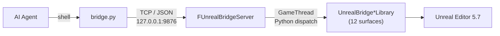

<p align="center">
  <h1 align="center">UnrealBridge</h1>
  <p align="center">
    <strong>A socket between your AI Agent and a live Unreal Engine 5.7 Editor.</strong>
  </p>
  <p align="center">
    <a href="LICENSE"></a>
    <a href="https://www.unrealengine.com/"></a>
    <a href="https://www.python.org/"></a>
    
    
    <a href="https://claude.ai/code"></a>
    <a href="README.zh-CN.md"></a>
  </p>
</p>

---

The Editor plugin runs a small TCP server on `127.0.0.1:9876` — query scenes, edit Blueprints, spawn actors, compile, start PIE, all over a local socket. A Python CLI and a Claude Code skill talk to it with length-prefixed JSON. Every call executes on the GameThread via `IPythonScriptPlugin::ExecPythonCommandEx`, so editor state (PIE, open assets, viewport camera, undo stack) survives across calls.

## Highlights

- **Stateful editor, stateless agent.** No reattaching, no respawning a process per call.
- **12 typed `UnrealBridge*Library` surfaces** covering Blueprint graphs, assets, AnimBP, UMG, level editing (transacted — Ctrl+Z works), materials, DataTables, GAS, navigation, an agent control layer, a reactive event subsystem, and editor session control (PIE / CVars / console / compile).
- **Two build loops.** `hot_reload.py` patches the running editor via Live Coding in ~10–60s for body-only edits. `rebuild_relaunch.py` cleanly relaunches when you touch reflection (`UFUNCTION` / `UCLASS` / `UPROPERTY`).
- **Claude Code skill included.** `.claude/skills/unreal-bridge/` bundles the CLI, per-library API reference docs, and a signature-discipline rule so Agent sessions don't waste round-trips on guessed function names.

## Architecture



## Quick Start

### 1. Clone

```bash
git clone https://github.com/<your-fork>/UnrealBridge.git
cd UnrealBridge
```

### 2. Install the plugin

Edit the `DST` line in `sync_plugin.bat` to point at your UE project's `Plugins/` folder:

```bat
set "DST=D:\Path\To\YourProject\Plugins\UnrealBridge"
```

Run `sync_plugin.bat`. It mirrors `Plugin/UnrealBridge/` into the project, skipping `Binaries/` and `Intermediate/`.

### 3. Build & launch

Open the `.uproject` and let UE rebuild the plugin (or run the project's `Build.bat`). Launch the editor — the plugin starts the server at `PostEngineInit`. Look for `LogUnrealBridge: Listening on 127.0.0.1:9876` in the log.

### 4. Verify

```bash
python .claude/skills/unreal-bridge/scripts/bridge.py ping
# → pong
python .claude/skills/unreal-bridge/scripts/bridge.py exec \
  "import unreal; print(unreal.UnrealBridgeLevelLibrary.get_level_summary())"
```

### Claude Code integration (optional)

Copy the skill so Claude Code finds it:

```bash
cp -r .claude/skills/unreal-bridge ~/.claude/skills/            # user-wide
# or into a project's own .claude/skills/
```

For `rebuild_relaunch.py` to auto-relaunch the editor, set one of:

```bash
setx UNREAL_EDITOR_EXE "C:\Program Files\Epic Games\UE_5.7\Engine\Binaries\Win64\UnrealEditor.exe"
setx UE_ROOT            "C:\Program Files\Epic Games\UE_5.7"
```

### Try it from your Agent

Once the skill is installed, paste any of these into a Claude Code session:

- *"List every PointLight in the current level."*
- *"Move the PlayerStart up by 200 units."*
- *"Compile `/Game/Blueprints/BP_Character` and tell me if it has errors."*
- *"Show me the state machine names inside `/Game/Animations/ABP_Hero`."*

The agent reads `SKILL.md`, picks the right `UnrealBridge*Library` function, calls it through `bridge.py`, and reports back.

## Usage

### CLI

```bash
bridge.py ping
bridge.py exec "print('hello from UE')"
bridge.py exec-file my_script.py
```

Flags: `--host`, `--port` (9876), `--timeout` (30s), `--json`.

### From Python inside UE

```python
import unreal

summary = unreal.UnrealBridgeLevelLibrary.get_level_summary()
print(summary)

lights = unreal.UnrealBridgeLevelLibrary.find_actors_by_class(
    "/Script/Engine.PointLight", 50
)
print(len(lights), "point lights")
```

### Reload loops

```bash
python .claude/skills/unreal-bridge/scripts/hot_reload.py        # body-only edits
python .claude/skills/unreal-bridge/scripts/rebuild_relaunch.py  # reflection changes
```

## Bridge libraries

| Library | Purpose |
|---|---|
| `UnrealBridgeServer` | TCP listener, length-prefixed JSON framing, GameThread dispatch |
| `UnrealBridgeBlueprintLibrary` | Class hierarchy, variables, functions, components, graph/node inspection, timelines, event dispatchers, write ops |
| `UnrealBridgeAssetLibrary` | Asset keyword search, derived classes, references, dependencies, DataAsset queries |
| `UnrealBridgeAnimLibrary` | AnimBP state machines, AnimGraph nodes, linked layers, slots, curves, sequence / montage / blend space info, skeleton bone tree |
| `UnrealBridgeDataTableLibrary` | DataTable row inspection |
| `UnrealBridgeMaterialLibrary` | Material instance parameter queries |
| `UnrealBridgeUMGLibrary` | Widget tree, properties, animations, bindings, events, search, write ops |
| `UnrealBridgeLevelLibrary` | Level / actor query + edit (spawn, destroy, move, attach, label, nested property get/set) — all transacted |
| `UnrealBridgeEditorLibrary` | Asset open / save, Content Browser sync, viewport camera, PIE start/stop/pause, undo/redo, console, CVars, redirector fixup, Blueprint compile |
| `UnrealBridgeGameplayAbilityLibrary` | GAS CDO introspection — tags, cost / cooldown GE classes |
| `UnrealBridgeGameplayLibrary` | PIE agent control surface — packed world observation, pathfinding, movement / look / jump input |
| `UnrealBridgeNavigationLibrary` | NavMesh queries and pathfinding helpers |
| `UnrealBridgeReactive*` | Subscribe to runtime events (GAS, attributes, actor lifecycle, anim notifies, input, timers) and editor asset events |

## Protocol

Length-prefixed JSON on `127.0.0.1:9876`:

```
Request :  [4-byte big-endian length][{"id","script","timeout"}]
Response:  [4-byte big-endian length][{"id","success","output","error"}]
Ping    :  {"id","command":"ping"}  →  pong
```

Scripts run on the GameThread. The `__UB_ERR__` sentinel separates captured stdout from stderr.

## Repository layout

```
UnrealBridge/
├── Plugin/UnrealBridge/         # UE 5.7 Editor plugin (C++)
│   ├── Source/UnrealBridge/     #   TCP server + bridge libraries
│   └── Content/Python/          #   Helpers auto-loaded into UE's Python env
├── .claude/skills/unreal-bridge/
│   ├── scripts/                 # bridge.py, hot_reload.py, rebuild_relaunch.py
│   └── references/              # Per-library API docs
├── docs/                        # Design notes and plans
├── tools/                       # Standalone helpers
└── sync_plugin.bat              # Mirror plugin into a UE project
```

## Requirements

- **Unreal Engine 5.7** with `PythonScriptPlugin` and `GameplayAbilities` (both ship with the engine)
- **Windows 10/11** — plugin is portable; helper scripts assume Windows paths
- **Python 3.9+** on PATH
- **Visual Studio 2022** with the UE workload — for plugin compilation
- **Claude Code CLI** — optional, only if you use the bundled skill

## Safety

- Level edits are wrapped in `FScopedTransaction` — Ctrl+Z in the editor reverts anything the bridge did.
- The TCP server binds to `127.0.0.1` only; it is not reachable from the network.

## License

MIT — see [LICENSE](LICENSE).
